# Database ERD

```mermaid
erDiagram
  organizations ||--o{ workspaces : owns
  organizations ||--o{ users : has
  organizations ||--o{ memberships : scopes
  users ||--o{ memberships : has
  workspaces ||--o{ memberships : grants
  workspaces ||--o{ entities : contains
  entities ||--o{ entity_revisions : snapshots
  entities ||--o{ external_references : maps
  sources ||--o{ external_references : identifies
  entities ||--o{ entity_resolution_cases : candidate
  entities ||--o{ entity_merges : source_or_target
  entity_merges ||--o{ entity_resolution_audits : audited
  entities ||--o{ relationships : endpoint
  entities ||--o{ events : subject
  entities ||--o{ memories : subject
  workspaces ||--o{ documents : contains
  documents ||--o{ document_versions : versions
  documents ||--o{ document_chunks : chunks
  documents ||--o{ document_links : source
  workspaces ||--o{ canvases : contains
  workspaces ||--o{ ingestion_runs : ingests
  sources ||--o{ source_assets : preserves
  source_assets ||--o{ ingestion_runs : originates
  ingestion_runs ||--o{ extraction_candidates : extracts
  workspaces ||--o{ sources : contains
  sources ||--o{ evidence : supports
  evidence ||--o{ evidence_links : attached_by
  entities ||--o{ evidence_links : evidenced
  relationships ||--o{ evidence_links : evidenced
  events ||--o{ evidence_links : evidenced
  documents ||--o{ evidence_links : evidenced
  memories ||--o{ evidence_links : evidenced
  organizations ||--o{ reasoning_runs : owns
  workspaces ||--o{ reasoning_runs : scopes
  users ||--o{ reasoning_runs : initiates
  entities ||--o{ reasoning_runs : customer_context
  reasoning_runs ||--o{ reasoning_run_citations : materializes
  evidence ||--o{ reasoning_run_citations : cited_by
  organizations ||--o{ action_proposals : owns
  workspaces ||--o{ action_proposals : scopes
  users ||--o{ action_proposals : requests_approves_executes
  action_proposals ||--o{ action_audits : audited
  users ||--o{ action_audits : acts
  workspaces ||--o{ integration_audits : records
  sources ||--o| mcp_connections : endpoint_for
  users ||--o{ mcp_connections : creates
  mcp_connections ||--o{ mcp_discovered_resources : catalogs
  mcp_connections ||--o{ mcp_resource_checkpoints : checkpoints
  ingestion_runs ||--o{ mcp_resource_checkpoints : last_success
  mcp_connections ||--o{ mcp_sync_schedules : schedules
  users ||--o{ mcp_sync_schedules : creates
  mcp_sync_schedules ||--o{ mcp_sync_schedule_resources : includes
  mcp_connections ||--o{ mcp_sync_runs : executes
  users ||--o{ mcp_sync_runs : requests
  mcp_sync_runs ||--o{ mcp_sync_items : contains
  ingestion_runs ||--o{ mcp_sync_items : stages
  mcp_sync_schedules ||--o{ mcp_schedule_ticks : claims
  mcp_sync_runs ||--o| mcp_schedule_ticks : generated_by
```

## Current tables

The migrated application schema contains `organizations`, `workspaces`, `users`,
`memberships`, `entities`, `entity_revisions`, `external_references`,
`entity_resolution_cases`, `entity_merges`, `entity_resolution_audits`,
`relationships`, `events`, `memories`, `sources`, `evidence`, `evidence_links`,
`documents`, `document_versions`, `document_chunks`, `document_links`, `canvases`,
`source_assets`, `ingestion_runs`, `extraction_candidates`, `reasoning_runs`,
`reasoning_run_citations`, `action_proposals`, `action_audits`,
`integration_audits`, `mcp_connections`, `mcp_discovered_resources`,
`mcp_resource_checkpoints`, `mcp_sync_schedules`,
`mcp_sync_schedule_resources`, `mcp_sync_runs`, `mcp_sync_items`, and
`mcp_schedule_ticks`. `alembic_version` is migration metadata, not a domain table.
The current tree has no persisted embeddings or metrics/signals tables.

## Constraints
- Unique external ref: `(organization_id, workspace_id, source_id, source_model, external_id)`.
- Odoo instance sources are unique by
  `(organization_id, workspace_id, source_type, uri)` when
  `source_type = 'odoo_instance'`.
- Generic MCP instance sources use the same tenant/workspace/URI identity when
  `source_type = 'mcp_instance'`; migration `8f512bac77f2` enforces this with a
  partial unique index.
- External references link to sources through the tenant-aware composite key
  `(organization_id, workspace_id, source_id)`.
- Tenant-owned records reference workspace by `(organization_id, workspace_id)`; linked records use tenant-aware composite foreign keys.
- `evidence_links` references exactly one target: Entity, Relationship, Event, Document, or Memory.
- Relationship indexes on `(from_entity_id, relationship_type)` and `(to_entity_id, relationship_type)`.
- Relationships reject self-loops and duplicate typed ordered edges through
  tenant/workspace-aware database constraints.
- Evidence supports document spans, Odoo fields, and calculation inputs.
- Resolution cases, merge journals, and audits use tenant-aware composite foreign
  keys. Database checks enforce valid case/merge state combinations.
- PostgreSQL serializes active merge participation for both source and target,
  preventing one entity from joining overlapping active merges under races.
- Merge journal scope, source/target, original actor, and snapshot are immutable;
  the database permits only the one-way `active` to `split` transition.
- Entity-owned external references, relationship endpoints, events, memories,
  and entity evidence links must point to active entities. This prevents writes
  that raced with a merge from attaching new data to the merged tombstone.
- `entity_resolution_audits` rejects all `UPDATE` and `DELETE` operations through
  a database trigger.
- Entity state used by historical projections is copied to append-only
  `entity_revisions` on every entity `INSERT`, `UPDATE`, and `DELETE`. Existing
  entities are backfilled at their original `created_at`. PostgreSQL rejects
  revision `UPDATE`, `DELETE`, and `TRUNCATE`; Customer 360 selects the latest
  same-scope revision at or before `as_of`, preventing later metadata/lifecycle
  updates from rewriting old risk assessments.
- `source_assets` reject update/delete and remain bound to the same
  organization/workspace/source as their `IngestionRun`.
- Terminal promoted/rejected ingestion reviews and accepted/rejected extraction
  candidates reject update/delete. `document_chunks` are append-only, and promoted
  version chunk membership rejects later inserts. Evidence and EvidenceLinks of type
  `ingested_document` reject update/delete and post-promotion membership extension,
  while unrelated Evidence workflows retain their existing lifecycle.
- `reasoning_runs` stores bounded citation UUID strings in `citation_ids`. An
  insert trigger validates 1–100 unique same-scope Evidence UUIDs, verifies actor
  workspace membership and an active customer target, then atomically materializes
  successful citations into `reasoning_run_citations`. Tenant-composite foreign
  keys keep Evidence references durable; both tables are append-only. Failed runs
  require an empty array and create no citation association rows.
- Reasoning-run state, context hash, provider identity, answer, uncertainty, and
  sanitized errors are database constrained. `UPDATE`, `DELETE`, and `TRUNCATE`
  are rejected by append-only triggers.
- `action_proposals` stores the immutable tenant/workspace-scoped connector,
  operation, target, parameters, reason, risk, requester, approval, and execution
  state. PostgreSQL accepts only `pending → approved → executed|failed`, checks
  current scoped membership for requester/approver/executor, requires distinct
  approval, and restricts delete approval to owners. Proposal deletion and
  truncation are rejected.
- `action_audits` has tenant-composite proposal/actor foreign keys and one unique
  event of each type per proposal. Insert validation binds event actor/outcome to
  the proposal state; a deferred proposal trigger requires the matching audit at
  commit. Audit `UPDATE`, `DELETE`, and `TRUNCATE` are rejected.
- `source_assets` preserves the exact uploaded bytes, filename/media type, byte
  size, and SHA-256 hash under the same tenant/workspace/source composite identity
  as its `IngestionRun`. PostgreSQL validates size/hash shape and rejects asset
  `UPDATE` and `DELETE`.
- Ingestion review checks require pending runs to have no reviewer/time/canonical
  links; promoted/rejected runs require a same-organization reviewer and timestamp;
  rejected runs require a reason; only promoted runs may hold matching scoped
  Document/DocumentVersion IDs. Promotion/rejection uses a row lock and terminal
  decisions cannot transition again.
- Generic MCP resource mapping uses one tenant-scoped MCP-instance `Source`, a
  canonical `Document` with immutable `DocumentVersion`, `Evidence` pointing to
  the source, and an exactly-one-target `EvidenceLink` pointing to the document.
  Existing composite foreign keys prevent cross-scope provenance links.
- `integration_audits` rejects `UPDATE` and `DELETE` through its original
  append-only trigger and rejects statement-level `TRUNCATE` through forward
  migration `187025f68e30`.
- Every MCP record is organization/workspace scoped. Composite foreign keys bind
  connection, Source, schedule, run, item, checkpoint, and ingestion identities so
  no MCP child can reference authority from another tenant or workspace.
- `mcp_connections` has one MCP-instance Source per scope, stores only a bounded
  server-owned credential key, and protects endpoint/source authority in both
  directions. Discovery lease state and cursor/cycle state are all-or-none.
- Discovered-resource and checkpoint identities are unique by scoped connection and
  SHA-256 URI hash. PostgreSQL verifies each hash against the exact URI; checkpoint
  identity is immutable and a non-empty target must reference the exact successful
  ingestion run, source, status, and content hash.
- Schedules allow 1–16 uniquely ordered resources and intervals from 300 through
  86,400 seconds. A schedule tick is unique for the scoped schedule/instant and for
  its generated sync run, preventing duplicate due-slot assignment.
- Sync runs enforce 1–16 requested resources, at most four workers, at most three
  attempts, lease/lifecycle consistency, immutable identity/policy, append-only
  deletion/truncation guards, and deferred agreement between terminal item outcomes
  and aggregate counters. Items bind any successful ingestion target through the
  same tenant/source/content identity used by checkpoints.
