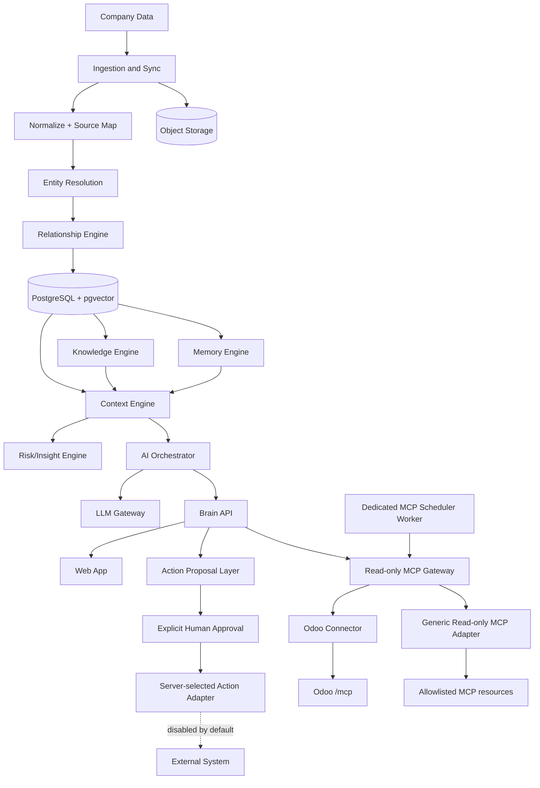

# System Architecture

## Logical architecture

The diagram combines implemented components with target boundaries. It is not an
implementation-status chart: consult [`roadmap.md`](roadmap.md) for phase gates.
In particular, the Compose MinIO service exists for development infrastructure,
but application object-storage/attachment flows and signed URLs are not
implemented. Persisted embeddings, semantic retrieval, automatic memory promotion/decay, and a
general-purpose queue-worker platform are deferred. Phase 16B4 does include a
dedicated external MCP scheduler worker for due dispatch and durable-run recovery.

## Bounded contexts
- **Core Brain:** tenants, workspaces, canonical entities, relationships, events, sources, evidence, metrics, signals, context objects. No Odoo leakage.
- **Knowledge Engine:** documents, Markdown, properties, tags, links, backlinks, attachments, search, semantic retrieval, JSON Canvas metadata.
- **Memory Engine:** semantic/episodic/decision/conversation/business memory with evidence and review status.
- **Context Engine:** intent-specific structured context builder; deterministic aggregation and metric calculation.
- **AI Orchestrator:** intent detection, entity disambiguation assist, retrieval/context planning, reasoning, answer + citations; it has no direct external-write authority.
- **Action Proposal Layer:** strict immutable write proposals, distinct human approval, row-locked controlled execution, connector idempotency, and durable append-only audit.
- **Integration Layer:** server-selected adapters/MCP clients; Odoo reads are implemented, while Phase 12 production action execution remains disabled until an explicit write adapter is configured.
- **Generic MCP Resource Layer:** URL-based, server-allowlisted, read-only
  `resources/list`/`resources/read`; deterministic mapping produces canonical
  Documents with Source/Evidence provenance. It exposes no generic tool caller.

## Request flow
1. User asks a business question.
2. Orchestrator detects intent, e.g. `CUSTOMER_360`.
3. Entity Resolver maps “ABC” to canonical Customer.
4. Context Engine retrieves relationships, business data, memories, documents, timeline.
5. Metrics/Risk services calculate deterministic values and signals.
6. LLM Gateway generates explanation over structured context.
7. API returns answer + evidence bundle.

## Controlled action flow

1. A scoped writer submits a strict provider-neutral action request.
2. Brain persists a `pending` proposal and `proposed` audit; no connector runs.
3. A different admin/owner reviews the immutable payload; delete requires owner.
4. Approval and its actor/time are persisted with a matching append-only audit.
5. An admin/owner executes the approved proposal through the server-selected
   adapter using the proposal UUID as idempotency key.
6. A PostgreSQL row lock serializes competing execution requests; the committed
   terminal state is `executed` or `failed` with exactly one matching audit.
7. Unknown adapters, invalid state, cross-scope IDs, and production default
   configuration fail closed. AI output cannot approve, mutate, or execute.

## Current stack and deferred infrastructure

The implemented stack is FastAPI, SQLAlchemy, Alembic, PostgreSQL, and a React
19/Vite operator client. PostgreSQL full-text search is active. The Compose image
includes pgvector and a MinIO service is available for development, but the
current application has no persisted embedding/vector-search path or object
storage integration. A general-purpose queue/worker platform remains optional future
infrastructure; `scripts/run_mcp_scheduler.py` is the implemented bounded MCP-specific
dispatcher and recovery worker that runs outside the web process.

## Research Sources

- [S1] Obsidian API: MIT type definitions; concepts: App, Vault, Workspace, MetadataCache, commands/views/settings — https://github.com/obsidianmd/obsidian-api
- [S2] JSON Canvas: MIT open `.canvas` format; top-level `nodes`/`edges`; node types `text`, `file`, `link`, `group` — https://github.com/obsidianmd/jsoncanvas
- [S3] Obsidian Importer: MIT, converts many exports/file formats to durable Markdown; fixture-based tests — https://github.com/obsidianmd/obsidian-importer
- [S4] Obsidian Web Clipper: MIT source; captures/highlights web to durable Markdown; trademarks/marketing assets excluded — https://github.com/obsidianmd/obsidian-clipper
- [S5] Obsidian Maps: MIT, property-driven map view for notes/coordinates — https://github.com/obsidianmd/obsidian-maps
- [S6] Obsidian Sample Plugin: 0BSD TypeScript plugin template/build conventions — https://github.com/obsidianmd/obsidian-sample-plugin
- [S7] Odoo MCP Server app: third-party Odoo 19 module, OPL-1, technical name `mcp_server`, exposes `/mcp`, OAuth 2.1/API key, read-only consent, per-model permissions, audit log — https://apps.odoo.com/apps/modules/19.0/mcp_server
- [S8] `ivnvxd/mcp-server-odoo`: MPL-2.0 local stdio bridge/YOLO mode for Odoo access — https://github.com/ivnvxd/mcp-server-odoo
